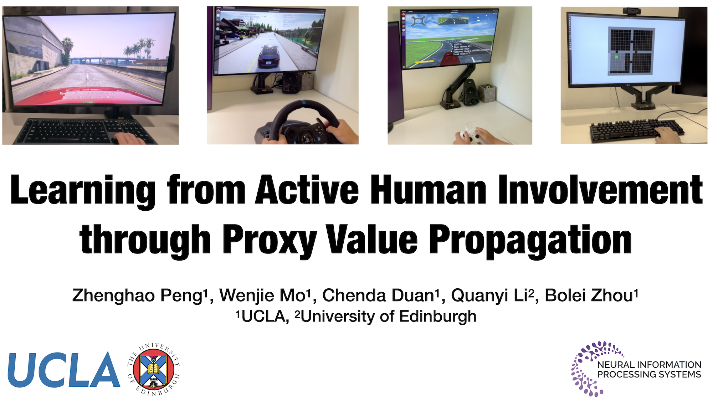

# [Proxy Value Propagation (PVP)](https://metadriverse.github.io/pvp/)

<h3><b>NeurIPS 2023 Spotlight</b></h3>

Official release for the code used in paper: *Learning from Active Human Involvement through Proxy Value Propagation*

[**Webpage**](https://metadriverse.github.io/pvp/) | 
[**Code**](https://github.com/metadriverse/pvp) |
[**Poster**](https://metadriverse.github.io/assets/img/pvp/PVP-Poster.pdf) |
[**Paper**](https://openreview.net/pdf?id=q8SukwaEBy)


[](https://metadriverse.github.io/pvp/)

## Installation

```bash
# Clone the code to local machine
git clone https://github.com/metadriverse/pvp
cd pvp

# Create Conda environment
conda create -n pvp python=3.7
conda activate pvp

# Install dependencies
pip install -r requirements.txt
pip install -e .

# Install evdev package (Linux only)
pip install evdev


# You now have installed MetaDrive and MiniGrid.
# To set up CARLA dependencies, please click the details below.
```

<details>
<summary><b>Set up CARLA dependencies</b></summary>

```bash
# Step 1: Download and unzip CARLA 0.9.10.1 to your home folder
cd ~/
wget https://carla-releases.s3.eu-west-3.amazonaws.com/Linux/CARLA_0.9.10.1.tar.gz
export CARLA_ROOT="CARLA_0.9.10.1"
mkdir ${CARLA_ROOT}
tar -xf CARLA_0.9.10.1.tar.gz -C ${CARLA_ROOT}  # CARLA is stored at: ~/CARLA_0.9.10.1

# Step 2: Setup the environment variables
vim ~/.bashrc
# Add following sentences and replace PATH_TO_CARLA_ROOT with the path to ${CARLA_ROOT} 
export CARLA_ROOT="~/CARLA_0.9.10.1"
export PYTHONPATH="${CARLA_ROOT}/PythonAPI/carla/":"${CARLA_ROOT}/PythonAPI/carla/dist/carla-0.9.10-py3.7-linux-x86_64.egg":${PYTHONPATH}

# Step 3: Activate your conda environment and test if CARLA is installed correctly.
conda activate pvp  # If you are using conda environment "pvp"
python -c "import carla"  # If no error raises, the installation is successful.

# Step 4: Install dependencies
pip install DI-engine==0.2.2
pip install torchvision
pip install markupsafe==2.0.1

# NOTE: If you are using a new conda environment, you might need to reinstall 'pvp' repo.
# Now let's jump to the CARLA section to run experiment!
```
</details>


## Launch Experiments

### MetaDrive

[Metadrive](https://github.com/metadriverse/metadrive) provides options for three control devices: steering wheel, gamepad and keyboard.

During experiments human subject can always press `E` to pause the experiment and press `Esc` to exit the experiment. The main experiment will run for 40K steps and takes about one hour. For toy environment with `--toy_env`, it takes about 10 minutes.

Click for the experiment details:


<details>
  <summary><b>MetaDrive - Keyboard</b></summary>

```bash
# Go to the repo root
cd ~/pvp

# Run toy experiment
python pvp/experiments/metadrive/train_pvp_metadrive.py \
--device keyboard \
--toy_env \
--exp_name pvp_metadrive_toy_keyboard

# Run full experiment
python pvp/experiments/metadrive/train_pvp_metadrive.py \
--device keyboard \
--exp_name pvp_metadrive_keyboard \
--wandb \
--wandb_project WADNB_PROJECT_NAME \
--wandb_team WANDB_ENTITY_NAME
```

| Action             | Control       |
|--------------------|---------------|
| Steering           | A/D           |
| Throttle           | W             |
| Human intervention | Space or WASD |
</details>


<details>
  <summary><b>MetaDrive - Steering Wheel (Logitech G29)</b></summary>

Note: Do not connect Xbox controller with the steering wheel at the same time!

```bash
# Go to the repo root
cd ~/pvp

# Run toy experiment
python pvp/experiments/metadrive/train_pvp_metadrive.py \
--device wheel \
--toy_env \
--exp_name pvp_metadrive_toy_wheel

# Run full experiment
python pvp/experiments/metadrive/train_pvp_metadrive.py \
--device wheel \
--exp_name pvp_metadrive_wheel \
--wandb \
--wandb_project WADNB_PROJECT_NAME \
--wandb_team WANDB_ENTITY_NAME
```


| Action             | Control                 |
|--------------------|-------------------------|
| Steering           | Steering wheel          |
| Throttle           | Throttle pedal          |
| Human intervention | Left/Right gear shifter |
</details>


<details>
  <summary><b>MetaDrive - Gamepad (Xbox Wireless Controller)</b></summary>

Note: Do not connect Xbox controller with the steering wheel at the same time!

```bash
# Go to the repo root
cd ~/pvp

# Run toy experiment
python pvp/experiments/metadrive/train_pvp_metadrive.py \
--device gamepad \
--toy_env \
--exp_name pvp_metadrive_toy_gamepad

# Run full experiment
python pvp/experiments/metadrive/train_pvp_metadrive.py \
--device gamepad \
--exp_name pvp_metadrive_gamepad \
--wandb \
--wandb_project WADNB_PROJECT_NAME \
--wandb_team WANDB_ENTITY_NAME
```
| Action             | Control                    |
|--------------------|----------------------------|
| Steering           | Left-right of Left Stick   |
| Throttle           | Up-down of Right Stick     |
| Human intervention | X/A/B & Left/Right Trigger |
</details>


### CARLA

We use CARLA 0.9.10.1 as the backend and use the environment created by [DI-Drive](https://github.com/opendilab/DI-drive) as the gym interface. CARLA uses a server-client architecture. To run experiment, launch the server first:

```bash
# Launch an independent terminal, then:
cd ~/CARLA_0.9.10.1  # Go to your CARLA root
./CarlaUE4.sh -carla-rpc-port=9000  -quality-level=Epic  # Can set to Low to accelerate
# Now you should see a pop-up window and you can use WASD to control the camera.
```

Click for the experiment details:

<details>
  <summary><b>CARLA - Steering Wheel (Logitech G29)</b></summary>

Note: Do not connect Xbox controller with the steering wheel at the same time!

```bash
# Launch the CARLA server if you haven't done yet
~/CARLA_0.9.10.1/CarlaUE4.sh -carla-rpc-port=9000  -quality-level=Epic  # Can set to Low to accelerate

# Go to the repo root
cd ~/pvp

# Run experiment without Wandb:
python pvp/experiments/carla/train_pvp_carla.py --exp_name pvp_carla_test

# Run full experiment
python pvp/experiments/metadrive/train_pvp_metadrive.py \
--exp_name pvp_carla \
--wandb \
--wandb_project WADNB_PROJECT_NAME \
--wandb_team WANDB_ENTITY_NAME
```

| Action             | Control                 |
|--------------------|-------------------------|
| Throttle           | Throttle pedal          |
| Human intervention | Left/Right gear shifter |
| Steering           | Steering wheel          |
</details>


### Minigrid


Click for the experiment details:

<details>
  <summary><b>MiniGrid - Keyboard</b></summary>

Mapping between environment nick name `--env` and `env_id`:
* `emptyroom` - `MiniGrid-Empty-6x6-v0`
* `tworoom` - `MiniGrid-MultiRoom-N2-S4-v0`
* `fourroom` - `MiniGrid-MultiRoom-N4-S5-v0`

```bash
# Go to the repo root
cd ~/pvp

# Run experiment without Wandb:
python pvp/experiments/minigrid/train_pvp_minigrid.py --exp_name pvp_minigrid_test

# Run full experiment
# Choose --env from ["emptyroom", "tworoom", "fourroom"]
python pvp/experiments/minigrid/train_pvp_minigrid.py \
--env tworoom \
--exp_name pvp_minigrid \
--wandb \
--wandb_project WADNB_PROJECT_NAME \
--wandb_team WANDB_ENTITY_NAME
```

| Action               | Control      |
|----------------------|--------------|
| Turn Left            | Left         |
| Turn Right           | Right        |
| Gown Straight        | Up           |
| Approve Agent Action | Space / Down |
| Open Door / Toggle   | T            |
| Pickup               | P            |
| Drop                 | D            |
| Done Complete Task   | D            |
</details>


## 📎 References

```latex
@inproceedings{peng2023learning,
  title={Learning from Active Human Involvement through Proxy Value Propagation},
  author={Peng, Zhenghao and Mo, Wenjie and Duan, Chenda and Li, Quanyi and Zhou, Bolei},
  booktitle={Thirty-seventh Conference on Neural Information Processing Systems},
  year={2023}
}
```

